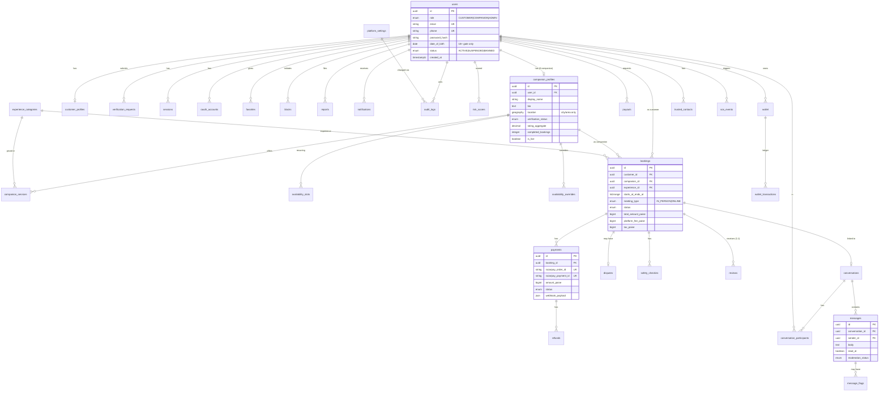

# Saath — Verified Companionship Marketplace
## Phase 1: Product & Technical Architecture

> **Saath** (Hindi: *साथ*, "together / in company") — *"A safe marketplace for booking verified companions for social experiences."*
>
> This document is the Phase 1 deliverable: product architecture, feature map, journeys,
> system design, database schema (with ER diagram), API design, security/payment/safety/AI
> architecture, MVP scope, roadmap, and risks. **No code is written in this phase.**

---

## Table of Contents

1. [Product Architecture](#1-product-architecture)
2. [Complete Feature Map](#2-complete-feature-map)
3. [User Journeys (Customer / Companion / Admin)](#3-user-journeys)
4. [Technical Architecture & Recommended Stack](#4-technical-architecture--recommended-stack)
5. [Database ER Diagram](#5-database-er-diagram)
6. [Database Tables & Enums](#6-database-tables--enums)
7. [API Architecture](#7-api-architecture)
8. [Security Architecture](#8-security-architecture)
9. [Payment Architecture](#9-payment-architecture)
10. [Safety & Trust Architecture](#10-safety--trust-architecture)
11. [AI / Matching & Risk Architecture](#11-ai--matching--risk-architecture)
12. [Folder Structure](#12-folder-structure)
13. [MVP Scope (V1)](#13-mvp-scope-v1)
14. [V2 / V3 Roadmap](#14-v2--v3-roadmap)
15. [Technical Risks](#15-technical-risks)
16. [Business & Regulatory Risks](#16-business--regulatory-risks)
17. [Recommended Improvements](#17-recommended-improvements)
18. [Key Architecture Decisions (ADRs)](#18-key-architecture-decisions-adrs)

---

## 1. Product Architecture

### 1.1 Positioning

Saath is a **three-sided trust-first marketplace**:

| Side | Core job | Success metric |
|---|---|---|
| **Customer** | Find a safe, verified, compatible companion for a specific social activity | Booking completed, 5★ review, repeat booking |
| **Companion** | Monetize social time professionally and safely | Utilization rate, earnings, low cancellation |
| **Platform/Admin** | Guarantee safety, quality, and payment integrity | Report resolution time, fraud rate, dispute rate |

The product is a fusion of **Marketplace (Airbnb-style trust layers) + Booking platform (Calendly-style availability) + Dating-style profile UX (strictly non-romantic framing) + Chat + Safety platform**. Every design decision passes the filter:

```
SAFETY → SECURITY → CORRECTNESS → UX → PERFORMANCE → FEATURES
```

### 1.2 Platform principles

1. **Safety is the product.** SOS, check-in/check-out, verification, and moderation are first-class surfaces — not buried in settings.
2. **Trust through verification, not marketing.** Badges must mean something (ID + age + phone + profile moderation).
3. **Money never moves off-platform.** Chat moderation and payment flow actively prevent off-platform transactions (which also protects users from scams).
4. **No irreversible automated punishment.** Risk systems flag and queue; humans action. Reversible auto-measures only (payout holds, re-verification challenges).
5. **Non-discriminatory by construction.** Matching never uses gender, religion, caste, or age (beyond the 18+ gate) as ranking signals.
6. **Privacy minimization.** Identity documents are processed by a hosted IDV provider; we store a status + reference, never document images.

### 1.3 System context (high level)

```
┌─────────────┐   HTTPS   ┌──────────────────────────────────────────────┐
│  Next.js    │◄─────────►│            NestJS API (REST + WS)             │
│  Web (PWA)  │           │  Auth · Companions · Booking · Payments ·     │
│  (App Router│           │  Chat GW · Wallet · Reviews · Safety · Admin  │
└─────────────┘           └───────┬───────────────┬───────────────┬──────┘
                                  │               │               │
                          ┌───────▼──────┐ ┌──────▼──────┐ ┌──────▼────────┐
                          │ PostgreSQL   │ │ Redis       │ │ S3-compatible │
                          │ (Prisma)     │ │ cache/queue │ │ storage (R2)  │
                          │ + pgvector*  │ │ BullMQ      │ │ presigned URLs│
                          └──────────────┘ └─────────────┘ └───────────────┘
        External: Razorpay (payments/payouts) · Hyperverge/Onfido (IDV) ·
        Resend (email) · MSG91 (SMS/OTP) · Sentry · OpenTelemetry
        (*pgvector introduced in V2 for ML matching)
```

---

## 2. Complete Feature Map

| Module | Customer | Companion | Admin |
|---|---|---|---|
| **Auth** | Email/password, Google OAuth, phone OTP, email verify, password reset, sessions, logout-all-devices | Same | Admin SSO + 2FA |
| **Profile** | Photo, display name, city, interests, visibility controls | Full pro profile: gallery, bio, languages, interests, personality, experiences, pricing, availability, stats | View all, moderate, hide |
| **Verification** | 18+ gate, phone/email verified | ID + age verification workflow via hosted IDV, badge states | Review queue, approve/reject, expiry |
| **Discovery** | Browse, search, filters, sort, map view*, AI compatibility score | Profile preview as-seen-by-others | Feature/boost controls* |
| **Availability** | See open slots, date picker | Weekly slots, date overrides, blocked dates, breaks, synced bookings | — |
| **Booking** | Request, pay, cancel/reschedule, history | Accept/reject, confirm, complete, cancel policy enforcement | View, intervene, force-cancel/refund |
| **Payments** | UPI/cards/netbanking via Razorpay, invoices, refunds | Earnings ledger, payouts/withdrawals | Refunds, disputes, commission config, reconciliation |
| **Chat** | 1:1, booking-linked threads, read receipts, typing, block/report | Same | Moderation queue, flagged messages |
| **Reviews** | Rate after completed bookings (5 categories) | Receive, respond*, report abusive reviews | Moderate, remove |
| **Safety** | SOS, trusted contacts, live check-in/out, safety resources | Same | Safety ops console, escalation queue |
| **Trust & Safety ops** | Report/block | Report/block | Reports triage, risk queue, warnings/suspensions/bans, audit log |
| **Notifications** | In-app, email, SMS, push* | Same | System broadcasts* |
| **Analytics** | — | Earnings funnel | KPIs, growth/revenue charts, funnels, fraud signals |

\* = V2/V3 item.

---

## 3. User Journeys

### 3.1 Customer journey

```
LAND (hero, trust signals, 18+ gate)
  → REGISTER (email/Google) → verify email → phone OTP → profile basics
  → EXPLORE (filters: city, experience, date, price, language, rating)
  → AI-ranked results w/ compatibility score
  → COMPANION PROFILE (gallery, badges, reviews, pricing, availability)
  → FAVORITE / START CHAT (inquiry) or REQUEST BOOKING
       select experience · date · start time · duration · in-person/online · area · note
  → PRICE BREAKDOWN (base + platform fee + GST) → RAZORPAY CHECKOUT
  → webhook confirms → booking CONFIRMED (companion accepted at request, or accept-after-pay*)
  → CHAT (moderated) → REMINDERS (24h / 1h before)
  → MEET → CHECK-IN (SOS + optional live location to trusted contact)
       → session → CHECK-OUT (reminder if missed → escalation)
  → COMPLETED → PAY companion after cooling period
  → REVIEW (communication, punctuality, respect, experience, overall)
  → REBOOK / FAVORITE
  Edge paths: cancel (policy-based refund) · dispute · report · refund status
```
\*MVP model: **request → companion accepts → customer pays (payment window) → confirmed**. This avoids capturing payment before acceptance and simplifies refunds. Alternative "pay-to-request" is a settings toggle for high-demand companions (V2).

### 3.2 Companion journey

```
REGISTER → apply "Become a Companion"
  → VERIFICATION (hosted IDV: ID document + face match + age ≥18; phone/email already done)
  → status: SUBMITTED → UNDER_REVIEW → VERIFIED / REJECTED (with reason)
  → BUILD PROFILE: gallery (moderated), bio, languages, interests, experiences offered
  → SET PRICING: per-experiment hourly/session rates; service areas; online/in-person
  → SET AVAILABILITY: weekly recurring slots + overrides/blocked dates/breaks
  → profile goes live after moderation approval
  → INBOX: booking requests → accept / decline (SLA shown → response-rate stat)
  → CHAT with customer (moderated)
  → SESSION: check-in/out, SOS
  → EARNINGS: ledger (gross − commission), pending → available after T+cooling
  → WITHDRAW: REQUESTED → UNDER_REVIEW (risk check) → APPROVED → PROCESSING → COMPLETED
  → REVIEWS received; stats (rating, completion, response/cancel rate)
```

### 3.3 Admin / moderation journey

```
ADMIN LOGIN (2FA) → DASHBOARD (KPIs, charts, alert queue)
Daily queues:
  · VERIFICATION queue (provider result + profile consistency) → approve/reject
  · PROFILE/PHOTO moderation queue → approve/hide
  · REPORTS queue (risk-classified) → investigate → warning / restriction /
    booking cancellation / suspension / ban (all audited)
  · FLAGGED MESSAGES → review → dismiss / warn / restrict
  · DISPUTES → evidence from chat/check-in → refund (full/partial) / release
  · PAYOUT approvals (high-risk held) → approve/reject
  · RISK queue (HIGH risk scores) → investigate
System config: commission %, customer fee %, GST, min booking, cancellation tiers,
categories, cities, announcements. Every admin action → audit_logs.
```

---

## 4. Technical Architecture & Recommended Stack

**Monorepo (pnpm workspaces + Turborepo), one language end-to-end: TypeScript.**

| Layer | Choice | Why |
|---|---|---|
| Web | **Next.js 15 (App Router) + TypeScript + Tailwind + shadcn/ui + Framer Motion + TanStack Query** | SSR/SEO for public pages, PWA push, accessible component base |
| API | **NestJS 10** (REST + Socket.IO gateway) | Modular DI architecture, guards/interceptors for RBAC, scales into teams |
| ORM | **Prisma** | Type-safe migrations, parameterized queries, easy PostgreSQL features |
| DB | **PostgreSQL 16** | `tstzrange` + `EXCLUDE` constraints for double-booking prevention; `pg_trgm`/FTS for search; `pgvector` in V2 |
| Cache/Queues | **Redis 7 + BullMQ** | Sessions/rate-limit store, OTP throttling, jobs: notifications, payouts, risk scoring, reconciliation, moderation |
| Realtime | **Socket.IO** (Redis adapter, JWT handshake) | Chat, typing, presence, read receipts, in-app notifications |
| Storage | **S3-compatible** (Cloudflare R2 prod / MinIO dev), presigned URLs, `sharp` re-encode, AV-scan hook | No file bytes through API; images normalized on upload |
| Auth | argon2id hashing · JWT access (15 min) + refresh token rotation (httpOnly cookie, 30 days, family reuse-detection) · Google OAuth · phone OTP (MSG91) | Standard, auditable, stateless scale |
| Payments | **Razorpay** (Orders API, Checkout, Webhooks, Route/Linked accounts for payouts) | UPI/cards/netbanking, India-appropriate; Cashfree as failover provider (V2) |
| IDV | **Hyperverge** (India: document + face match + age) or Onfido; hosted flow | We never store document images; only status + reference |
| Email | **Resind → Resend / AWS SES** | Transactional templates, deliverability |
| SMS/OTP | **MSG91** | India OTP deliverability |
| Push | Web Push (VAPID) | PWA notifications |
| Observability | **pino** structured logs · **OpenTelemetry** traces · **Sentry** errors | Production debuggability |
| Testing | **Vitest** (unit) · **Supertest** (API integration) · **Playwright** (E2E) | Coverage of money, booking, auth, permissions |
| Infra | Docker Compose (dev) · Vercel (web) · Railway/Render/Fly or AWS ECS (api) · managed Postgres + Redis | Simplest production path; IaC (Terraform) in V3 |

**Why not a single Next.js full-stack app?** Faster to build, but Socket.IO, long-running BullMQ workers, and webhook/idempotency concerns are cleaner in a dedicated service, and NestJS modules map 1:1 to the domain modules in this doc. The shared `packages/shared` (zod schemas + enums + types) keeps end-to-end type safety.

---

## 5. Database ER Diagram

> Full column detail in §6. Mermaid source below (renders in GitHub/Notion/mermaid.live).



---

## 6. Database Tables & Enums

### 6.1 Enums

```
user_role            CUSTOMER | COMPANION | ADMIN
user_status          ACTIVE | SUSPENDED | BANNED | DELETED (soft delete)
verification_status  NOT_STARTED | SUBMITTED | UNDER_REVIEW | VERIFIED | REJECTED | EXPIRED
booking_status       REQUESTED | PENDING_PAYMENT | CONFIRMED | IN_PROGRESS
                     | COMPLETED | CANCELLED | DISPUTED | REFUNDED
                     -- "UPCOMING" is a DERIVED view: CONFIRMED AND start_time > now()
meeting_type         IN_PERSON | ONLINE
payment_status       CREATED | PENDING | CAPTURED | FAILED | REFUNDED | PARTIALLY_REFUNDED
refund_status        REQUESTED | APPROVED | PROCESSED | REJECTED
payout_status        REQUESTED | UNDER_REVIEW | APPROVED | PROCESSING | COMPLETED | REJECTED | ON_HOLD
wallet_txn_type      BOOKING_CREDIT | COMMISSION_DEBIT | REFUND_DEBIT | REFUND_CREDIT
                     | PAYOUT_DEBIT | ADJUSTMENT | PROMO_CREDIT
review_status        PUBLISHED | HIDDEN | REPORTED
report_status        OPEN | TRIAGED | INVESTIGATING | ACTIONED | DISMISSED
report_reason        HARASSMENT | FAKE_PROFILE | SCAM | THREAT | INAPPROPRIATE_CONTENT
                     | PROHIBITED_SERVICE | PAYMENT_FRAUD | OTHER
moderation_status    PENDING | FLAGGED | HELD | CLEARED | REMOVED
risk_level           LOW | MEDIUM | HIGH
risk_event_type      SIGNUP_VELOCITY | PAYMENT_FAILURE | CANCELLATION_SPIKE | CHARGEBACK
                     | MESSAGE_FLAG | REPORT | DEVICE_SHARED | OFF_PLATFORM_PAYMENT_ATTEMPT
checkin_status       NOT_STARTED | CHECKED_IN | CHECKED_OUT | MISSED_ESCALATED
notification_channel IN_APP | EMAIL | SMS | PUSH
availability_kind    WEEKLY_RECURRING | DATE_OVERRIDE | BLOCKED | BREAK
admin_action         WARN | RESTRICT | CANCEL_BOOKING | SUSPEND | BAN | RESTORE | VERIFY_APPROVE
```

### 6.2 Core tables (key columns; all tables have `id uuid pk default gen_random_uuid()`, `created_at`, `updated_at`; soft delete `deleted_at` where noted)

**users** — `email citext unique`, `phone_e164 unique null`, `password_hash` (argon2id), `google_sub null`, `role`, `status`, `date_of_birth date` (18+ assertion; never shown), `email_verified_at`, `phone_verified_at`, `last_active_at`, `locale`, `deleted_at`.
- Indexes: email, phone, status, role, last_active_at.

**customer_profiles** — `user_id fk unique`, display_name, avatar_key, city, interests (text[]), bio, visibility (`PUBLIC | PRIVATE`).

**companion_profiles** — `user_id fk unique`, display_name, tagline, bio, avatar_key, gallery_keys (text[], moderated), city, area, `geo point null` (rough, city-level only), languages text[], interests text[], personality_tags text[], `meeting_types`, response_rate, cancellation_rate, completed_count, rating_avg, rating_count, `verification_status`, `is_live` (requires VERIFIED + moderation approved + ≥1 service + availability), `deactivated_at`.
- Indexes: city, verification_status, is_live, rating_avg, completed_count; trigram GIN on display_name; GIN on interests/languages.

**experience_categories** — slug unique (`coffee`, `dinner`, `movie`, `event`, `city_tour`, `walking`, `gaming`, `study`, `conversation`, `online`, …), name, description, icon, is_active, sort_order.

**companion_services** — `companion_id fk`, `experience_id fk`, pricing model (`HOURLY | SESSION`), `rate_paise bigint`, min_duration_minutes, is_active. Unique(companion_id, experience_id).

**availability_slots** (weekly recurring) — companion_id, day_of_week 0–6, start_time, end_time (local tz stored per companion).
**availability_overrides** — companion_id, date, kind (`AVAILABLE | BLOCKED | BREAK`), tstzrange optional, reason.
- Free-slot computation: recurring slots for date − overrides − confirmed bookings (`tstzrange`).

**bookings** — customer_id fk, companion_id fk, experience_id fk, `scheduled tstzrange NOT NULL`, duration_minutes, meeting_type, meeting_area (in-person; no exact address pre-booking), note (moderated), status, `base_paise`, `platform_fee_paise`, `tax_paise`, `total_paise`, `companion_credit_paise` (gross − commission), cancellation_reason, cancelled_by, idempotency_key unique.
- **Double-booking prevention (authoritative at DB):**
  `EXCLUDE USING gist (companion_id WITH =, scheduled WITH &&)`
  `WHERE (status IN ('CONFIRMED','IN_PROGRESS','PENDING_PAYMENT'))` — requires `btree_gist`.
  Application also uses `SELECT ... FOR UPDATE` inside a transaction with a final availability re-check.
- Indexes: customer+status, companion+status, scheduled, experience.

**payments** — booking_id fk, razorpay_order_id unique, razorpay_payment_id null unique, amount_paise, currency, status, method, webhook_events jsonb[], captured_at. **Never trust client**: state transitions only via verified webhook signature; idempotent processing keyed on `razorpay_payment_id + event`.
**refunds** — payment_id fk, amount_paise, reason, status, razorpay_refund_id, initiated_by (user/admin), dispute_id null.

**wallets** — user_id (companion) unique, `pending_paise`, `available_paise`, `withdrawn_paise` (all bigint, derived from ledger but cached).
**wallet_transactions** (append-only ledger) — wallet_id, type, amount_paise (signed), balance_after_paise, ref_type (`BOOKING|PAYOUT|REFUND|ADJUSTMENT`), ref_id, created_by. No updates/deletes — corrections via compensating entries.
**payouts** — companion_id, amount_paise, bank_account_ref (Razorpay linked account id / fund account id — no raw account numbers stored), status, risk_hold_reason, processed_at, provider_ref.

**conversations** — booking_id null fk (pre-booking inquiry threads allowed; auto-linked on booking), created_from context.
**conversation_participants** — conversation_id, user_id, last_read_message_id, joined_at; unique pair.
**messages** — conversation_id, sender_id, body (text; media V2), read_at, `moderation_status`, risk_score, edited_at, deleted_at (soft; tombstone). Indexes: conversation+created.
**message_flags** — message_id, flagged_by (system/user), signal types, risk_level, reviewed_by, resolution.

**reviews** — booking_id unique fk (one review per booking, only COMPLETED, only by customer), companion_id fk, ratings: communication, punctuality, respect, experience, overall (1–5 each), comment (moderated), status, created_at. Companion response V2.

**favorites** — customer_id, companion_id, unique pair.
**blocks** — blocker_id, blocked_id, unique pair (blocks visibility + messaging both directions).
**reports** — reporter_id, reported_user_id null, ref_type (`USER|MESSAGE|REVIEW|BOOKING`), ref_id, reason, details, status, risk_level, assigned_to, resolution, action_taken.
**disputes** — booking_id unique, opened_by, reason, evidence_refs, status, resolution (`REFUND_FULL|REFUND_PARTIAL|RELEASE|CANCEL`), decided_by, decided_at.

**safety_checkins** — booking_id unique, status (NOT_STARTED/CHECKED_IN/CHECKED_OUT/MISSED_ESCALATED), checked_in_at, checked_out_at, location_share_enabled, location_points (ephemeral, TTL-deleted by cron), reminders_sent_at[].
**trusted_contacts** — user_id, name, phone_e164, relationship; max 3; receives SMS link only during active session with consent.
**sos_events** — user_id, booking_id null, triggered_at, location jsonb null, resolved_at, resolved_by, notes.

**verification_requests** — user_id, provider (hyperverge/onfido), provider_ref, idv_type, asserted_age_gte_18 bool, face_match bool, status, rejection_reason, reviewed_by, expires_at. **No document images stored.** Retention: provider-hosted, reference only.

**notifications** — user_id, type, channel, payload jsonb, read_at, sent_at.
**sessions / refresh_tokens** — user_id, token_hash, family_id, user_agent, ip, rotated_at, revoked_at, expires_at. Reuse of a rotated token → revoke whole family (theft detection).
**oauth_accounts** — user_id, provider, provider_sub unique.

**risk_events** — user_id, type, signal jsonb, risk_delta, created_at. **risk_scores** — user_id unique, score int, level, updated_at, reasons jsonb.
**audit_logs** — actor_id, action, target_type, target_id, before/after jsonb, ip, user_agent, created_at. Append-only.
**platform_settings** — singleton versioned rows: `customer_fee_percent`, `companion_commission_percent`, `tax_percent_gst`, `min_booking_paise`, cancellation tiers (hours-before → refund %), payout_cooldown_hours, inquiry message limits, maintenance flags. All changes audited; effective-dated so historical bookings keep their fee snapshot (fees are snapshotted onto the booking row).

### 6.3 Money rules

- All amounts **BIGINT paise** (₹1 = 100 paise). No floats anywhere.
- Fee/tax percentages live in `platform_settings`, **never hardcoded**, and are snapshotted onto each booking/payment at creation.
- Ledger is append-only; wallet balances are cached sums verified by a nightly reconciliation job against Razorpay settlement reports.

---

## 7. API Architecture

REST under `/api/v1`, JSON envelope, Socket.IO under `/ws`.

### 7.1 Response envelope

```jsonc
// success
{ "data": { ... }, "meta": { "requestId": "req_..." } }
// list
{ "data": [ ... ], "meta": { "page": 1, "pageSize": 20, "total": 137, "cursor": "eyJ..." } }
// error (never leaks internals; codes are stable strings)
{ "error": { "code": "BOOKING_SLOT_UNAVAILABLE", "message": "This slot was just taken.", "details": [] }, "meta": { "requestId": "..." } }
```

### 7.2 Endpoint map

```
POST   /auth/register                 POST /auth/otp/request|verify
POST   /auth/login                    POST /auth/oauth/google
POST   /auth/refresh                  POST /auth/logout            (all devices: /logout-all)
POST   /auth/forgot-password          POST /auth/reset-password
POST   /auth/verify-email

GET    /users/me                      PATCH /users/me              GET /users/:id (public-safe)
GET    /profiles/me                   PATCH /profiles/me

GET    /experience-categories
GET    /companions                    ?city&lat,lng,radius&experience&language&interest
                                       &priceMin&priceMax&rating&date&duration&meetingType
                                       &verifiedOnly&sort=recommended|rating|price_asc|
                                        price_desc|most_booked|recently_active&q=
GET    /companions/:id                (public profile; hidden if !is_live unless owner/admin)
GET    /companions/:id/services       GET /companions/:id/reviews
GET    /companions/:id/availability?date=
POST   /companions/:id/favorite       DELETE same
POST   /companions/apply              PATCH /companions/me          (profile, services, photos)
PUT    /companions/me/availability    (slots + overrides)

POST   /verification/session          (creates hosted IDV session) → provider redirect
POST   /verification/webhook          (provider callback)

POST   /bookings                      (body validated; availability re-check in txn;
                                       idempotency key)            → REQUESTED
GET    /bookings                      (role-scoped)
GET    /bookings/:id
POST   /bookings/:id/accept           (companion)
POST   /bookings/:id/reject
POST   /bookings/:id/cancel           (policy engine computes refund %)
POST   /bookings/:id/complete         (auto-cron 2h after end + manual confirm)
POST   /bookings/:id/checkin|checkout
POST   /bookings/:id/dispute

POST   /payments/orders/:bookingId    (server creates Razorpay order after re-validation)
POST   /payments/webhook/razorpay     (HMAC-verified, idempotent)
GET    /payments/:id

GET    /wallet                        GET /wallet/transactions
POST   /wallet/payouts                GET /wallet/payouts/:id

GET    /conversations                 POST /conversations (bookingId or companionId)
GET    /conversations/:id/messages    (paginated)
WS     /ws  → events: message:send, message:new, typing, presence, read:receipt,
              notification:new

POST   /reviews                       (booking completed, not already reviewed)
GET    /reviews?companionId=

POST   /reports                       POST /blocks  GET/DELETE /blocks
POST   /safety/sos                    GET/POST /safety/trusted-contacts
POST   /safety/checkins/:bookingId    POST /safety/location (ephemeral)

GET    /notifications                 PATCH /notifications/:id/read

/admin/dashboard                      (KPIs + chart series)
/admin/users?q=&status=               GET /admin/users/:id  (full view, risk, history)
/admin/users/:id/{verify|warn|suspend|ban|restore}
/admin/verifications                  /admin/reports        /admin/messages/flagged
/admin/disputes/:id/decide            /admin/payouts/:id/{approve|reject|hold}
/admin/refunds                        /admin/risk-queue
/admin/settings (GET/PUT, audited)    /admin/audit-logs
```

### 7.3 Cross-cutting middleware pipeline

```
request → helmet/secure-headers → CORS allowlist → request-id → body size limits
  → auth guard (JWT/cookie) → RBAC guard (role) → resource-ownership guard (ABAC)
  → zod/DTO validation → rate limiter (Redis: global / auth / otp / booking / chat)
  → controller (Prisma transactions for money & booking)
  → response interceptor (envelope) → filter: mapped errors (no stack traces leaked)
  → audit log (mutating admin/financial actions) → pino log
```

Pagination: offset for admin tables, cursor for messages/feeds. All list endpoints allow `sort` whitelist only (never raw SQL).

---

## 8. Security Architecture

| Concern | Control |
|---|---|
| Password storage | **argon2id** (memory-hard); never logged; reset via signed single-use email token (15 min) |
| Sessions | Short-lived JWT access (15 min) + rotating refresh token in `__Host-` httpOnly, Secure, SameSite=Lax cookie; refresh family reuse-detection revokes family; "logout all devices" |
| CSRF | SameSite cookies + **double-submit CSRF token** for cookie-auth state changes; Origin/Host check |
| Brute force | Redis rate limits: login 5/min/IP+account (lockout w/ exponential backoff), OTP 3/hour, register 3/hour/IP; global 100 req/min/IP |
| Input validation | zod (shared package) + class-validator on API; Prisma parameterized queries (no raw string SQL; FTS uses bound params) |
| XSS | React escaping by default; CSP (`default-src 'self'`, Razorpay domain allowlisted for checkout); rich text never rendered; chat body plain-text only |
| File uploads | Presigned PUT to object storage; allowlist (jpeg/webp/png, ≤8MB); server re-encode via `sharp` (strips EXIF/payloads); AV-scan webhook hook; random keys, no user-controlled paths |
| Authorization | RBAC (role) + ABAC ownership guards on every resource route; admin routes require ADMIN + 2FA; companion actions require VERIFIED |
| Payments | Razorpay order created server-side; **webhook HMAC SHA256 verification**; idempotent event processing; client never sets amount/status; no card data touches our servers (Razorpay Checkout) |
| PII / IDV | Documents via provider hosted flow; store status+ref only; DOB used solely for 18+ gate; geo precision capped to city/area; live location ephemeral with TTL purge |
| Secrets | `.env` locally; Doppler / AWS Secrets Manager in prod; never in logs, git, or client bundles; `NEXT_PUBLIC_` audited |
| Headers/transport | Helmet, HSTS, CSP, `X-Content-Type-Options`, `Referrer-Policy: strict-origin-when-cross-origin`; TLS everywhere; HTTPS-only cookies |
| Audit | Append-only `audit_logs` for admin actions, payouts, refunds, settings, verification decisions |
| Abuse prevention | Idempotency keys on bookings/payments; per-user quotas (favorites, reports/day, messages to non-booking threads); device/IP velocity signals → risk engine |
| Data retention | Soft deletes for users (30-day purge), messages retained per policy, location points TTL 24h post-session |
| Backups | Managed Postgres PITR, daily encrypted backups, restore drill quarterly |

---

## 9. Payment Architecture

### 9.1 Flow (Razorpay, India — UPI / cards / netbanking)

```
1. Customer confirms booking → POST /bookings (status REQUESTED)
2. Companion accepts → status PENDING_PAYMENT (payment window 30 min; auto-expire cron)
3. Server re-validates availability + pricing in a DB transaction →
   creates Razorpay Order (amount = snapshot total in paise) → returns order id
4. Razorpay Checkout (client; no card data touches us)
5. Razorpay → POST /payments/webhook/razorpay
   · verify HMAC signature (webhook secret)
   · idempotency key: event id + payment id (processed-once table)
   · payment.captured  → txn: payment CAPTURED, booking CONFIRMED, ledger:
        platform revenue = platform_fee_paise + tax_paise
        companion wallet (pending) += companion_credit_paise
   · payment.failed    → payment FAILED; booking stays PENDING_PAYMENT until window closes
6. Reminders; booking auto-complete cron 2h after scheduled end → COMPLETED
   → companion pending balance becomes AVAILABLE after cooldown (default 48h, chargeback buffer)
```

### 9.2 Refunds & disputes

- Cancellation policy engine: tiers in settings (e.g., >48h → 100%, 24–48h → 50%, <24h → 0%), admin-overridable.
- Refund created server-side → Razorpay Refund API → webhook confirms → ledger entries; booking → REFUNDED/CANCELLED.
- Dispute: evidence auto-attached (chat thread, check-in/out, moderation flags) → admin decision (full / partial / release).

### 9.3 Payouts

```
Companion requests withdrawal → payout REQUESTED
  → risk check (risk_score, disputes open, chargeback history) → UNDER_REVIEW
  → admin/auto-approve for LOW risk → APPROVED
  → Razorpay Route transfer to linked fund account (KYC-verified at onboarding)
  → PROCESSING → COMPLETED (webhook confirmation); ON_HOLD if HIGH risk
```
Bank details collected via Razorpay's hosted KYC — we store only the fund-account reference.

### 9.4 Integrity

- Money math in paise integers; fee snapshot on booking; ledger append-only; **nightly reconciliation** against Razorpay settlement files; alert on mismatch.
- Failover provider (Cashfree) abstracted behind a `PaymentProvider` interface (V2).

---

## 10. Safety & Trust Architecture

### 10.1 Safety Center (in-app, one tap from anywhere — persistent SOS affordance)

- **SOS button**: opens emergency sheet → one tap calls **112** (India), alerts Saath safety team (24/7 queue + paging), and optionally SMSes trusted contacts a temporary live-location link.
- **Trusted contacts**: up to 3; notified only with explicit per-session consent.
- **Check-in / check-out state machine** tied to the booking:
  ```
  session start → CHECK-IN (prompt) → ACTIVE → CHECK-OUT
       missed check-out: +15 min reminder → +30 min reminder to both users
       → +45 min escalate to safety team (MISSED_ESCALATED) with context
  ```
- **Location sharing**: ephemeral, only during an active in-person booking, user-initiated, points auto-purged 24h after session (cron). **No continuous background tracking.**
- Safety resources screen: guidelines, emergency numbers, grievance officer contact (IT Rules 2021).

### 10.2 Report & moderation pipeline

```
Report (user) OR system flag (risk engine / message moderation)
  → risk classification (rule score + signals) → LOW/MED/HIGH
  → moderation queue (HIGH jumps queue + pages on-call)
  → investigation: user history, messages, bookings, risk events, check-in data
  → action (all audited, proportional, reversible-first):
       warning → temporary feature restriction → booking cancellation/refund
       → profile suspension → permanent ban
  → reporter notified of outcome (privacy-appropriate)
```

### 10.3 Message moderation hooks

- **Synchronous pre-send**: blocklist/regex for phone numbers, off-platform payment keywords ("Paytm/UPI/GPay me", "pay outside"), URLs → risk score.
  - LOW → delivered + flagged. MEDIUM → delivered + sender warning nudge ("Keep payments on Saath — you're protected here"). HIGH → held for review, recipient sees "message under review".
- **Async (BullMQ)**: deeper classification (rule engine in V1; LLM-assisted scoring in V2) → flags for the queue. **AI never auto-punishes** — it only scores and routes.
- Pre-booking inquiry threads are rate-limited and nudged toward booking; contact-info sharing is blocked until a booking exists.

### 10.4 Anti-fraud / risk engine

Signals → `risk_events` → weighted score per user → `risk_scores` (LOW/MED/HIGH):
- signup velocity (same device/IP), repeated payment failures, chargebacks, cancellation spikes, message flags, reports, off-platform payment attempts, profile inconsistency (photo vs IDV face mismatch from provider), location inconsistencies.
- Responses are **reversible and graduated**: captcha/re-verification challenge, payout hold, booking restrictions → human review. Never auto-ban.

### 10.5 Policy surfaces (content, versioned, linked at signup & footer)

Terms of Service · Privacy Policy (DPDP Act 2023 consent model) · Community Guidelines · **Prohibited Services Policy** (explicit: no sexual/illegal services; zero-tolerance) · Cancellation & Refund Policy · Safety Guidelines · Grievance Officer page (IT Rules 2021).

---

## 11. AI / Matching & Risk Architecture

### 11.1 Compatibility matching (V1 heuristic, V2 ML-ready)

```
CompatibilityScore = w1·InterestMatch      (Jaccard over interests tags)
                   + w2·LanguageMatch      (requested languages ∩ spoken)
                   + w3·ActivityMatch      (experience categories fit)
                   + w4·LocationMatch      (distance decay, city/area precision)
                   + w5·AvailabilityMatch  (slots covering requested datetime/duration)
                   + w6·BudgetMatch        (rate within stated budget band)
                   + w7·QualityScore       (rating, response rate, completion rate)
                   + w8·TrustBoost         (VERIFIED badge, age of profile, no flags)
```

- Weights live in `platform_settings`; computed in a `RecommendationEngine` with a **`RecommendationStrategy` interface** (`HeuristicStrategy` in V1) so V2 can swap in `MLStrategy` (pgvector embeddings of profile text + collaborative signals) without touching call sites.
- Hard filters applied first (city, availability, verified, price ceiling, 18+); soft scoring ranks the rest.
- **Explicitly excluded signals**: gender, religion, caste, age (other than ≥18 gate), marital status. Code review checklist enforces this.
- Free-text preference ("likes movies, coffee, gaming, speaks Hindi & English") parsed via lightweight keyword/tag extraction in V1; LLM tag extraction in V2.

### 11.2 Risk AI

Same strategy pattern: `RuleBasedRiskStrategy` V1 (weights/thresholds in settings), `ModelBasedStrategy` V2 (anomaly detection on events). All outputs are **advisory scores routed to humans**.

### 11.3 Analytics (privacy-conscious)

Server-side event ingestion (no third-party trackers with PII): `signup, profile_completed, companion_verified, search, profile_view, favorite, booking_started, booking_completed, payment_success, payment_failed, chat_started, review_submitted, report_created`. Admin funnel: profile view → booking request → payment → completed → review.

---

## 12. Folder Structure

```
saath/
├── apps/
│   ├── web/                          # Next.js 15 (App Router)
│   │   ├── app/
│   │   │   ├── (marketing)/          # /, /explore, /companion/[id], /terms, /privacy…
│   │   │   ├── (auth)/               # login, register, forgot-password, verify
│   │   │   ├── (app)/                # dashboard, bookings, booking/[id], messages,
│   │   │   │                         # favorites, notifications, wallet, reviews, safety,
│   │   │   │                         # become-a-companion, verification, help
│   │   │   ├── companion/            # companion-dashboard, availability, earnings, bookings
│   │   │   └── admin/                # admin dashboard + queues
│   │   ├── features/                 # auth/ companions/ bookings/ chat/ wallet/
│   │   │                             # reviews/ safety/ admin/ (components + hooks per domain)
│   │   ├── components/ui/            # shadcn/ui primitives
│   │   ├── lib/api/                  # typed API client (generated from shared types)
│   │   ├── hooks/  stores/  styles/
│   │   └── tests/                    # Playwright e2e
│   └── api/                          # NestJS
│       ├── src/
│       │   ├── modules/
│       │   │   ├── auth/             # guards, strategies, otp, oauth, sessions
│       │   │   ├── users/  profiles/ companions/ verification/
│       │   │   ├── search/           # filters, sort, recommendation strategy
│       │   │   ├── availability/     # slot computation, override logic
│       │   │   ├── bookings/         # booking state machine, pricing engine, policies
│       │   │   ├── payments/         # razorpay provider, webhooks, refunds, reconcile jobs
│       │   │   ├── wallet/           # ledger, payouts
│       │   │   ├── chat/             # Socket.IO gateway, conversations, moderation hooks
│       │   │   ├── reviews/ favorites/ reports/ blocks/ disputes/
│       │   │   ├── safety/           # sos, checkins, trusted contacts, escalation jobs
│       │   │   ├── risk/             # risk events, scoring, moderation queue
│       │   │   ├── notifications/    # in-app/email/sms/push providers + BullMQ
│       │   │   ├── admin/            # dashboard metrics, user mgmt, settings, audit
│       │   │   └── analytics/
│       │   ├── common/               # filters, interceptors, decorators, pagination, errors
│       │   ├── prisma/               # schema.prisma, migrations, seed
│       │   └── main.ts
│       └── test/                     # vitest unit + supertest integration
├── packages/
│   ├── shared/                       # enums, zod schemas, shared TS types, fee math
│   └── config/                       # eslint, tsconfig, tailwind preset
├── infra/
│   ├── docker-compose.yml            # postgres (+pgvector), redis, minio, mailhog
│   └── docs/                         # runbooks, deployment checklist
└── turbo.json  pnpm-workspace.yaml
```

---

## 13. MVP Scope (V1)

Per the spec's MVP strategy, V1 ships:

1. Auth (email/password, Google OAuth, phone OTP, verify, reset, sessions)
2. User & companion profiles (with photo moderation queue)
3. Verification workflow (Hyperverge/Onfido hosted integration; sandbox mode for dev)
4. Discovery: explore grid, search, full filter/sort panel, companion profile page
5. Availability (weekly slots + overrides; backend-validated)
6. Booking engine (request → accept → pay → confirm → complete; state machine; exclusion constraint)
7. Payments: Razorpay sandbox (orders, checkout, webhooks, refunds), fee engine
8. Chat: Socket.IO 1:1, booking-linked, receipts/typing/presence, moderation hooks
9. Reviews (post-completion, 5 categories)
10. Report/block + admin moderation queue
11. Safety Center: SOS, trusted contacts, check-in/out + escalation cron
12. Wallet ledger + payout requests (manual approve in admin; Razorpay payout in sandbox)
13. Admin dashboard: KPIs, users, verifications, reports, disputes, payouts, settings, audit log
14. Notifications: in-app + email (SMS for OTP/SOS only in V1)
15. Foundations: rate limiting, audit logs, risk scoring v1 (rules), error/loading/empty states, SEO basics, responsive mobile-first UI, Playwright happy-path E2E

**Explicitly deferred to V2/V3** below — V1 is a complete, deployable, monetizable product, not a demo.

---

## 14. V2 / V3 Roadmap

**V2 — Intelligence & scale**
- ML recommendation (pgvector embeddings + collaborative signals), LLM preference parsing
- LLM-assisted message moderation + risk anomaly model
- Wallet promos/credits, referral program, pay-to-request option for top companions
- Cashfree failover, automated payout rules, tax invoices (GST) automation
- Push notifications, companion review responses, map view
- Advanced admin analytics (funnels, cohort retention, city/category breakdowns)
- Number masking (Exotel) for calls; multi-city launch tooling

**V3 — Platform**
- Mobile apps (React Native) with native SOS/location
- Corporate/event packages, group bookings
- Advanced fraud detection, device fingerprinting
- Personalization, dynamic pricing suggestions for companions
- Terraform IaC, multi-region, background-check partner integration
- Companion insurance partnership, 24/7 safety call center integration

---

## 15. Technical Risks

| Risk | Mitigation |
|---|---|
| **Double booking / slot races** | Postgres `EXCLUDE` gist constraint + `FOR UPDATE` txn + availability re-check at payment creation; constraint is the authority |
| **Webhook duplication / missed events** | Idempotency table keyed on provider event id; reconciliation cron pulls payment/payout status; payment window expiry cron |
| **Money correctness** | Paise integers, append-only ledger, fee snapshots, nightly reconciliation vs settlement reports, no floats |
| **Realtime scale** | Single Socket.IO node + Redis adapter in V1 (fine for launch city); stateless horizontal scaling later; presence via Redis TTL keys |
| **Search quality at scale** | Postgres FTS + trigram in V1; interface allows Meilisearch swap in V2 |
| **IDV provider dependency/failure** | Provider behind interface; verification status flow supports manual review fallback; graceful "under review" UX |
| **Razorpay account categorization** | Abstract `PaymentProvider`; Cashfree integration ready in V2; legal docs prepared for KYB |
| **Notification deliverability** | Transactional email via Resend with bounce handling; OTP via SMS with fallback; in-app always works |
| **N+1 / performance** | Prisma `include` batching, pagination caps, Redis caching of public explore results (60s), image optimization via Next/Image + R2 |

---

## 16. Business & Regulatory Risks

| Risk | Mitigation |
|---|---|
| **Legal posture (India)** | Platform facilitates *social companionship only*; Prohibited Services Policy + zero-tolerance messaging everywhere; 18+ gate + IDV age assertion; compliance with **IT Rules 2021** (grievance officer, 24/7 reporting, monthly compliance report); **DPDP Act 2023** consent & data minimization; legal review before launch |
| **Payment partner acceptance** | Category may be treated as high-risk; prepare policy docs, KYB, moderation SOPs; integrate failover provider; no adult-content wording anywhere in branding/metadata |
| **Trust/safety incidents** | SOS + check-in escalation SOPs, 24/7 on-call for HIGH queue, incident response runbook, insurance exploration (V3), user education, conservative launch (one city, vetted supply) |
| **Verification fraud** | Hosted IDV with face match + liveness; profile photo ↔ IDV face consistency check; periodic re-verification; badge expiry |
| **Supply-side quality/churn** | Onboarding checklist, response-rate SLAs surfaced, earnings transparency, review system, companion support |
| **Off-platform leakage (disintermediation)** | Moderation of contact-info/payment solicitation, payment protection messaging, holding contact details until booking, report incentives |
| **Unit economics** | Commission configurable (default 15% companion side + small customer fee); min booking value; monitor acquisition → completed booking payback |

---

## 17. Recommended Improvements

1. **Single-city launch (e.g., Delhi NCR / Greater Noida)** with hand-vetted first companions — quality and safety over breadth; city-gated onboarding.
2. **Number masking via Exotel** in V2 so phone numbers are never exposed pre-booking.
3. **Scheduled automated safety call** for first-time bookings (V2) — proactive trust signal.
4. **Companion "Trust tiers"** (Verified → Verified+ (re-verified, 50 bookings, 0 reports)) — gamifies safety.
5. **SEO city/experience landing pages** ("coffee companion in [city]") for acquisition, with noindex on user-specific pages.
6. **Feature flags** from day one (Unleash/LaunchDarkly-style simple table) for risky launches.
7. **Accessibility & security in CI**: axe-core checks, E2E on critical flows, dependency scanning, `npm audit` gating.
8. **Public transparency page**: safety report (bookings verified, reports actioned) — trust as marketing.
9. **Wallet promo credits** (ledger-native) for first-booking incentives instead of raw discounts.
10. **In-app legal acceptance flow** with versioned policy records per user (needed for disputes/audits).

---

## 18. Key Architecture Decisions (ADRs)

1. **Monorepo, TypeScript everywhere** — shared zod schemas give end-to-end type safety; one language for hiring velocity.
2. **NestJS + Next.js split** (not full-stack Next) — dedicated API for Socket.IO, BullMQ workers, webhook idempotency.
3. **PostgreSQL as source of truth incl. booking exclusion constraints** — no availability logic living only in Redis.
4. **Money in paise BIGINT + append-only ledger** — floats are banned in money code; balances cached but reconcilable.
5. **Request → accept → pay** flow in V1 — fewer refunds, simpler ledger; pay-to-request is a V2 setting.
6. **Hosted IDV, zero document retention** — liability and DPDP minimization; we store status + reference.
7. **AI advises, humans action** — risk/matching outputs are scores; irreversible actions require a human; audit-logged.
8. **Razorpay-first with provider interface** — India-appropriate, UPI support; Cashfree failover without rewrite.
9. **Ephemeral, consent-based location** — active-session-only, TTL purge, no background tracking.
10. **Fee/commission/policy settings in DB, versioned & snapshotted** — historical bookings always reproduce their math.

---

*End of Phase 1 architecture. Awaiting approval before Phase 2 (Design System & UI/UX).*
